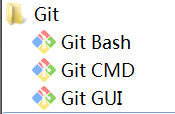
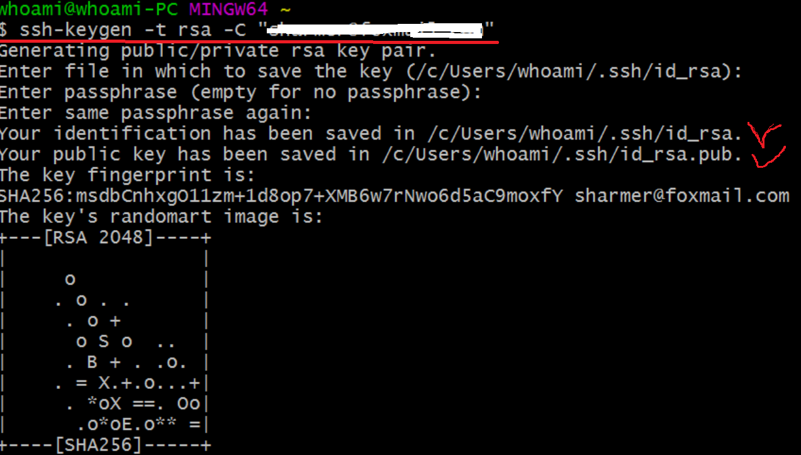
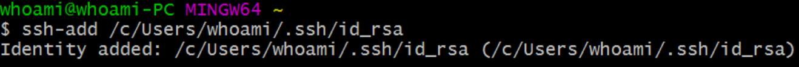
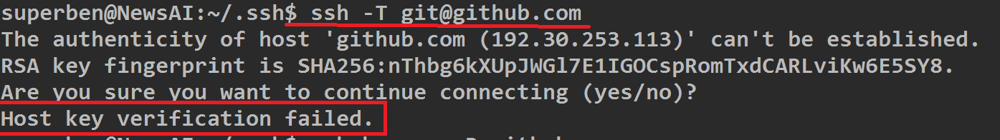

Git
=====
场景
-----
在windows上会做一些调试代码的工作，然后，要同步到github上去。
在学习AI时，程序真正的运行都在ubuntu机器上（GPU）

git for windows
---------------------
安装
^^^^^^
安装可见《github入门与实践》p21，完成后，会有三个程序：

生成rsa
^^^^^^^^^
在git bash中执行

启动ssh-agent
^^^^^^^^^^^^^^^
1. 在git bash中执行

$eval $(ssh-agent -s)

2. 将SSH私钥添加到 ssh-agent

配置文件不受git管理
--------------------
1. 下载python.gitignore模板, `link <https://github.com/yiwenliu/gitignore/blob/master/Python.gitignore>`_
2. 下载并重命名为.gitignore到.git/同级目录下
3. 编辑.gitignore

本地仓库和远程仓库
--------------------
1. 在本地提及仓库，就是指.git目录

2. 在本地仓库（.git目录）中可以记录有多个远程仓库

3. 每一个远程仓库都有一个“标识符”

4. 在执行git clone命令后，被克隆的那个仓库自动记录为远程仓库，并且取名为origin

5. 其他非clone源的远程仓库，也能添加为本地的远程仓库，但需要执行
$git remote add命令来手工添加

6. 要添加一个新的远程仓库，可以指定一个简单的名字，以便将来引用，运行 $git remote add [shortname] [url]

7. 添加远程仓库后

1）$git remote可以看到新添加的远程主机标识符

2）但是，$git branch 
-a依然无法显示新添加的远程主机的分支，仍然只能显示标识符为origin的远程主机的分支

3）查看远程仓库的信息可以使用
$git remote show <标识符>

git管理的文件的状态
---------------------
从来没有add/commit的文件：Untracked files

add后：Changes to be committed

commit后：nothing to commit, working tree clean

commit后又修改的：changes not staged for commit

从远程仓库同步代码
------------------
当要从远端仓库获取代码时，pull, clone, fetch到底使用哪一个呢？

pull
^^^^^^
PULLis a high-level request that runs ‘fetch’ then a ‘merge’ by default,

.. code-block:: none
	:linenos:

	%> git checkout localBranch
	%> git pull origin master
	%> git branch
	master
	* localBranch

The above will merge the remote “master” branch into the local “localBranch”.

fetch
^^^^^^^
$ git fetch [remote-name][分支名]

1. 执行这个命令时要注意，本地哪里来的remote-name记录，途径：

  1）$git remote add手工添加
  2）之前执行过$git clone，自动取名的

2. 这个命令执行完成后，它们将被保存在本地的 "remote-name /分支名" 分支，
可以通过$git branch -a查看

clone
^^^^^^^
$ git clone <版本库的网址>

在一个目录下执行$git clone操作后完成了以下操作：

- 新建了一个远端仓库版本库同名的子目录, 如果要指定不同的目录名，可以将目录名作为git clone命令的第二个参数,$ git clone <版本库的网址> <本地目录名>
- 不需要执行$git init，在新建的子目录下就会有.git文件夹
- 这个远端仓库可以使任意的github上的仓库，不必先folk到自己账户下，然后在执行clone
- 自动给远端仓库取名为“origin”
- 这个命令可以相当于执行了如下两个命令

$git remote add
$git fetch

Q&A
------
git push时需要输入github的account
^^^^^^^^^^^^^^^^^^^^^^^^^^^^^^^^^^
It is my understanding that GitHub has switched to using TLS 1.2, which is causing this error when your program is still trying to connect to GitHub using TLS 1.0.

重新安装最新版本的Git即可

认证Github时报错
^^^^^^^^^^^^^^^^^^
ubuntu和Github进行链接认证时报错，如下图

解决方法：$ssh-keyscan -t rsa github.com >> ~/.ssh/known_hosts