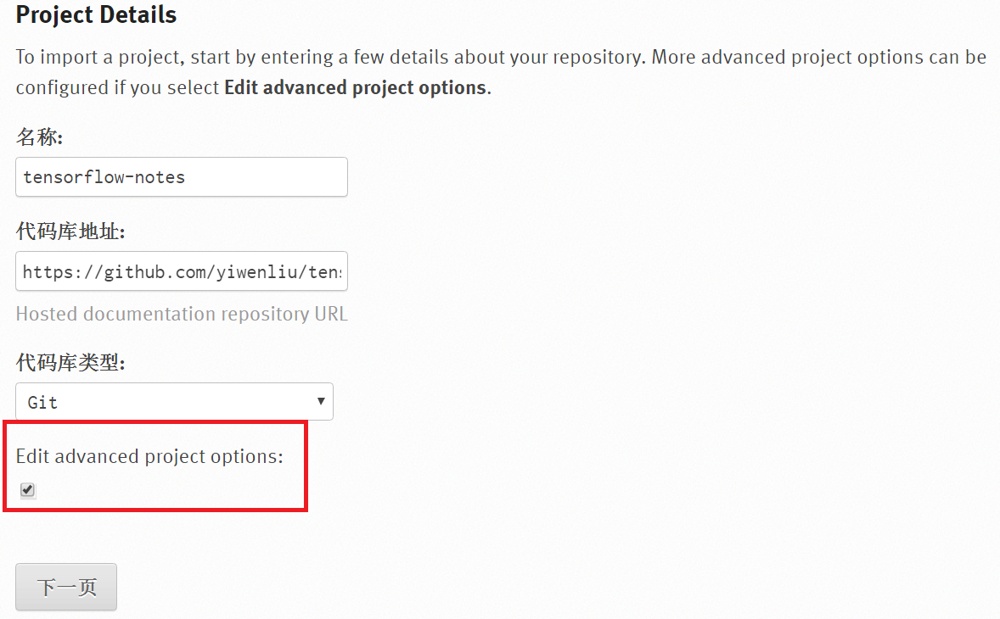
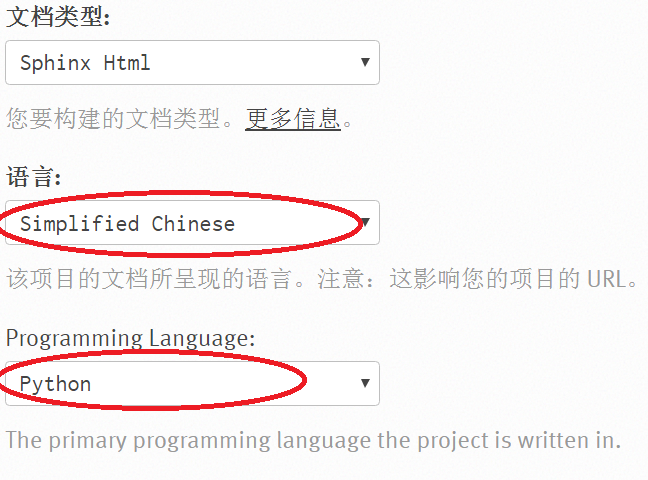

使用ReadtheDocs托管文档
=======================
采用Sphinx + GitHub + ReadtheDocs 作为文档写作工具，用以替代Evernote。
使用reStructuredText格式写作，Sphinx 生成文档，GitHub 托管文档，再导入到 ReadtheDocs。

Instllation
--------------
安装sphinx
^^^^^^^^^^^
参考了https://www.xncoding.com/2017/01/22/fullstack/readthedoc.html中的安装命令。

虽然是在windows+Anaconda环境中安装sphinx，但是仍然建议使用$pip install，而不是$conda install

工作流程
----------
1. 用sphinx初始化workspace

其实就是在一个目录中创建了一些make html时需要的文件和子目录，在"Anaconda Prompt"中执行如下命令

.. code-block:: none
  :linenos:

  # 创建文档根目录
  mkdir -p /root/work/scrapy-cookbook
  cd scrapy-cookbook/
  # 可以回车按默认配置来写
  sphinx-quickstart

在初始化的过程中，sphinx会提示确认如下信息：

- Separate source and build directories (y/n) [n]: y
- Project name: util-notes
- Author name: yiwen
- Project language: zh_CN
- Source file suffix:.rst/.txt
- autodoc: automatically insert docstrings from modules (y/n) [n]: y
- intersphinx: link between Sphinx documentation of different projects (y/n) [n]:y

初始化完成后，在root path中生成的子目录的作用如下：

- _build:place the build directory for sphinx output
- _templates: custom html templates
- _statics:custom stylesheets and other static files

2. 更改主题 sphinx_rtd_theme

参考https://www.xncoding.com/2017/01/22/fullstack/readthedoc.html

3. 预览效果

参考https://www.xncoding.com/2017/01/22/fullstack/readthedoc.html

4. 在workspace中，用sublime写reStructuredText格式的笔记

5. 在github上创建仓库，命名为util-notes

6. 建立github仓库和sphinx root path的同步

在git bash下执行如下命令

.. code-block:: none

  $cd D:\sphinx-docs\tensorflow-notes
  $echo "# tensorflow-notes" >> README.md #创建名为readme的markdown格式文件
  $git init  #初始化了空的Git仓库，新建了一个.git子目录，即仓库，存储着管理当前目录内容所需要的仓库
  数据，当前目录就是“附属于该仓库的工作树”，
  $git remote add origin https://github.com/yiwenliu/util-notes.git #设置本地仓库的远程仓库
  $cp .gitignore to sphinx root path
  $git add .
  $git commit -m "first commit"
  $git push -u origin master

7. 建立ReadtheDocs和Github之间的hook

- 登录readthedocs.org
- 点击"import project"，按照页面提示，联结github账号，并导入repository。需要注意下两幅图中的设置。创建完后会自动去激活Webhooks，不用再去GitHub设置，Commit alway and your project will auto-update.

8. push笔记到Github，ReadtheDocs会自动更新

Q&A
-----
构建失败报错
^^^^^^^^^^^^^^
**Package inputenc Error: Unicode char(inputenc) not set up for use with LaTeX.**

进入readthedoc的项目-管理-郜婕高级设置，取消"Enable PDF build"