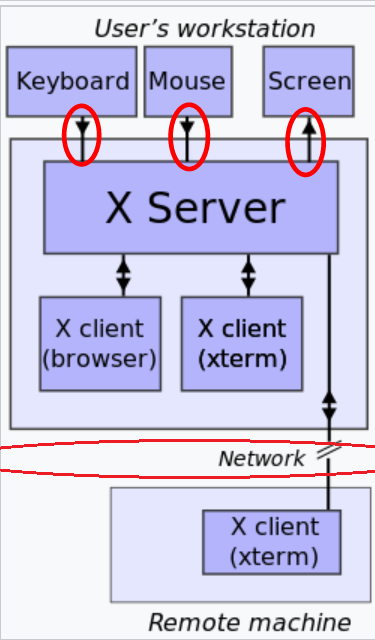
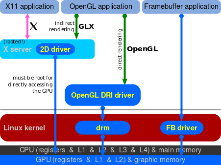

Ubuntu
========
Install Ubuntu 16.04 LTS
--------------------------
https://www.techonthenet.com/linux/sysadmin/ubuntu/install_16_04.php

在登录界面无法进入桌面
------------------------
20180321，配有GPU的机器被人异常关机后，重新开机，在登录界面循环，无法进入系统桌面(login loop)

1. 以为是密码错误

从网上寻找了重制ubuntu密码的方法, `method1 <http://blog.topspeedsnail.com/archives/6042>`_, `method2 <http://www.linuxdiyf.com/linux/21513.html>`_, 但是依然停在登录界面。

仔细观察登录界面，当输入错误密码时，会提示“invalid password”，而输入正确密码时就没有这个提示了。于是，怀疑是密码是对的，但是为什么进不了桌面呢？

2. ubuntu desktop故障

使用ctrl + alt + f1 ~f6进入ubuntu的字符界面，验证了密码的正确性， ctrl + alt +f7返回GUI。

网上关于密码正确进不去系统桌面的解决方案主要有两个：

- 重装desktop(failed)

.. code-block:: python
	:linenos:

	sudo apt-get update  
	sudo apt-get install --reinstall ubuntu-desktop  
	sudo apt-get install unity  
	sudo shutdown -r now  

- 查看登录异常文件(OK)

ctrl+alt+f1进入控制台，在家目录下查看.Xauthority和.xsession-errors（记录了登录异常，可以直接打开该文件）文件，应该和登录时间相符，

$rm -f .Xaut*

只执行这条命令还是无法进入桌面，考虑到非正常关机，卸载了NVIDIA的驱动后，就可以进去桌面了。

- startx(failed)

进入tty1, 运行startx

- 磁盘满(no trying)

`cleat boot space <http://www.wangmingkuo.com/linux/ubuntu-%E6%A1%8C%E9%9D%A2%E8%BF%9B%E4%B8%8D%E5%8E%BB-%E5%BE%AA%E7%8E%AF%E5%87%BA%E7%8E%B0%E7%99%BB%E9%99%86%E7%95%8C%E9%9D%A2/>`_, 我使用$df -hl查看，磁盘并没有满啊

配置固定IP
------------
1. 修改NetworkManager.conf

$sudo gedit /etc/NetworkManager/NetworkManager.conf

将“managed=false”修改为“managed=true”。意思是，将网络连接设置为自定义或手动。

$sudo service network-manager restart #重启network manager

因为，如果Ubuntu系统采用的是desktop版，由于desktop版安装了NetworkManager，修改完interfaces文档中的内容后，不会生效。需要先修改/etc/NetworkManager/NetworkManager.conf文档中的managed参数，使之为true，并重启系统， 然后在修改/etc/network/interfaces文件，设置静态IP

2. `修改interfaces文件 <https://www.jianshu.com/p/d69a95aa1ed7>`_

.so文件的运行机理
------------------
运行mesos时，出现过“cannot find shared object"的错误，这是找不到动态链接库的错误。在安装cuDNN时，也就是几个.so文件。

关于.so，linux中有这么几个点：

1. 动态库加载程序

/lib/ld.so

2. .so默认存放路径

 /usr/lib; /lib

3. .so路径环境变量——LD_LIBRARY_PATH

1）在shell中添加

export LD_LIBRARY_PATH=$ LD_LIBRARY_PATH: /usr/local/lib

2）shell启动时默认添加

如果不想每次新启一个shell都设置LD_LIBRARY_PATH，可以编辑~/.bash_profile文件：
$ vi ~/.bash_profile

添加：
LD_LIBRARY_PATH=$ LD_LIBRARY_PATH:/usr/local/lib
export LD_LIBRARY_PATH

4. .so路径配置文件——/etc/ld.so.conf

在/etc/ld.so.conf.d下面添加配置文件*.conf，写一行/usr/local/lib（libc.conf已经存在了），保存过后ldconfig一下，新的 library才能在程序运行时被找到。

5. 寻找.so文件的顺序

LD_LIBRARY_PATH     /etc/ld.so.conf     /usr/lib; /lib

6. 就是不管做了什么关于library的变动后，最好都ldconfig一下，不然会出现一些意想不到的结果。不会花太多的时间，但是会省很多的事。

X window system
-----------------
在安装nvidia驱动的过程中，经常会碰到X display, X server, X client等概念，于是就想搞清楚X windows system.

1. X系统有四大组件：

- X server

Xwindow 系统服务器端，通过驱动程序（硬件规范）来管理硬件资源。那么，在安装有nvidia GPU的机器上直接操作的话，GPU就属于X server了吧？注意，如果通过putty连接时使用的是ssh，而不是X windows系统 

- X client
- X Window Manager

Window Manager 是一种特殊的 Xclient,用于控制窗口程序的位置和外观，常说的GNOME, XFEC桌面就属于“窗口管理员”。使用窗口管理器时，Xserver 并不直接与其它 Xclient 通信，而是通过 WM 中转，当一些消息被定义为 WM 指令时，它们会被拦截。例如 Alt+F4 关闭窗口、拖动标题栏……

- Display Manager

2. 这四个组件的工作流程可以参见 

- `x server&x client <https://i.linuxtoy.org/docs/guide/ch19s03.html>`_ 
- `x window manager <https://i.linuxtoy.org/docs/guide/ch19s04.html>`_

渲染的概念
------------
渲染（英语：render，或称“绘制”）在电脑绘图中，是指：用软件从模型生成图像的过程。模型是用语言或者数据结构进行严格定义的三维物体或虚拟场景的描述，它包括几何、视点、纹理、照明和阴影等信息。图像是数字图像或者位图图像。渲染用于描述：计算视频编辑软件中的效果，以生成最终视频的输出过程。通常依靠图形处理器（GPU）完成这个过程。

OpenGL
--------
OpenGL（英语：Open Graphics Library，译名：开放图形库或者“开放式图形库”）是用于渲染2D、3D矢量图形的跨语言、跨平台的应用程序编程接口（API）。

OpenGL规范由1992年成立的OpenGL架构评审委员会（ARB）维护,NVIDIA是成员之一。

GLX
-----
GLX (initialism for "OpenGL Extension to the X Window System") is an extension to the X Window System core protocol providing an interface between OpenGL and the X Window System as well as extensions to OpenGL itself. It enables programs wishing to use OpenGL to do so within a window provided by the X Window System. 

GLX consists of three parts:

- An API that provides OpenGL functions to an X Window System application.
- An extension of the X protocol, which allows the client (the OpenGL application) to send 3D rendering commands to the X server (the software responsible for the display). The client and server software may run on different computers.
- An extension of the X server that receives the rendering commands from the client and passes them on to the installed OpenGL library

If client and server are running on the same computer and an accelerated 3D graphics card using a suitable driver is available, the former two components can be bypassed by DRI. In this case, the client application is then allowed to directly access the video hardware through several API layers.

GLX distinguishes two "states": indirect state（上图） and direct state（下图）.

.. image:: _images/Linux_graphics_drivers_Utah_GLX.svg.png

（上图）Indirect rendering over GLX, using Utah GLX

（上图）early Direct Rendering Infrastructure