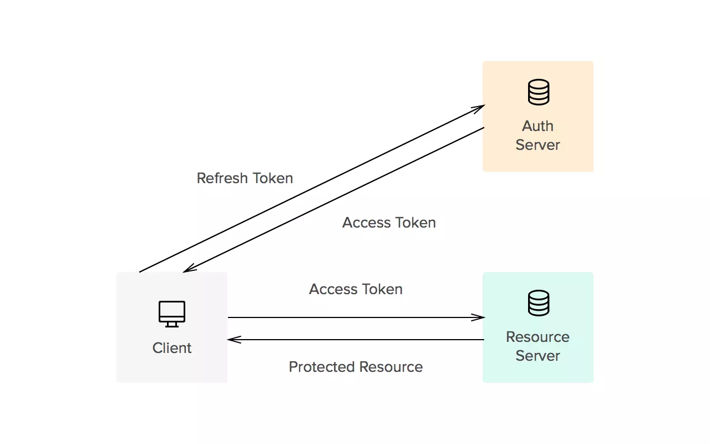

(web)API
=============

appid, apikey, secretKey
-----------------------------
- 在共有云平台上，创建一个应用，就有一个对应的appid。
- Api key简称API接口验证序号，是用于验证API接入合法性的。接入哪个网站的API接口，就需要这个网站允许才能够接入。科大讯飞的验证方法是，加一个http header，X-CheckSum=MD5(APIKey + X-CurTime + X-Param)，后台拿到这个checksum后，后台把它存储的apikey也做同样的计算，如果相等，就验证通过。
- apikey和secretkey是成对出现的，同一个 app_id 可以对应多个 apikey+secretkey, 这样 平台就可以分配你不一样的权限, 比如 apikey1 + secretkey 只有只读权限 但是 apikey2+secretkey 有读写权限.. 这样你就可以把对应的权限 放给不同的开发者.  其中权限的配置都是直接跟app_key 做关联的, 

但是在讯飞云平台中，在我创建的应用中，申请了多个服务，每个服务的APIKey都是一样的。

有道平台
^^^^^^^^^^
在有道平台，

- 和每个应用对应的两个：“应用ID”（就是appkey）和“应用密钥”，并无api key。
- appkey和密钥仅仅对请求进行“签名”，并没有对请求内容进行加密，见请求参数http://ai.youdao.com/docs/doc-trans-api.s#p04：sign, 签名信息，sha256(appKey+input+salt+curtime+密钥)

refresh token
---------------
参考链接 https://juejin.im/post/5a56f7f75188257340262691#heading-0

