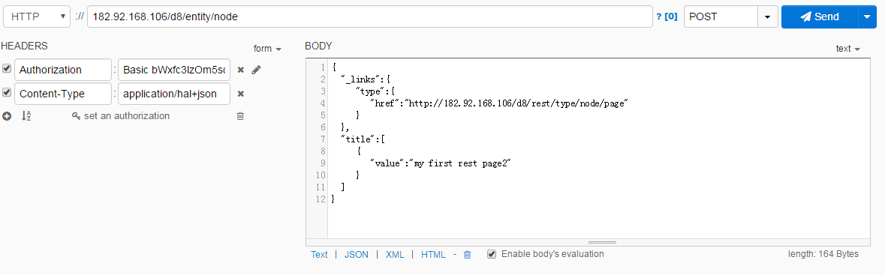
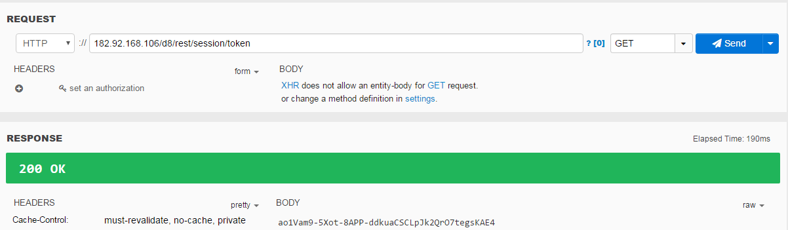

Rest
========
阮一峰讲ReST
-----------------
1. 理解RESTful架构
     使用文中的讲解对drupal的API进行分析：

1）entity/node是Resource

2）hal+json是Representation

3）POST是state transfer方法

2. RESTful API 设计指南
    资源的URI，称为“路径”，必须可以清晰的表达一个资源，“路径”中的分层结构——e.g./zoos/ID/animals：列出某个指定动物园的所有动物——可以有如下的两个方面的解释：1）和“过滤信息/参数”可以互为冗余，GET /zoo/ID/animals 与 GET /animals?zoo_id=ID 的含义是相同的；2）分层的每一级所用的名词往往与数据库的表格名对应，因为所谓“资源”在后台看来或是某个功能，或是数据库中的数据。
     API的设计主要包括两个方面：client发送的http request的link和payload的设计。

1）api的版本可以写在uri中，而资源的版本不宜写在uri中
2）RESTful API最好做到Hypermedia，即返回结果中提供链接，连向其他API方法，使得用户不查文档，也知道下一步应该做什么。
3）一些设计误区。

测试工具
----------
1. Dev HTTP Client Chrome extension
2. Guzzle, which is a great new tool included in Drupal 8 Core
3. cURL via the command line or PHP

用chrome插件测试drupal REST的过程
------------------------------------
step1:

采用上图的方法，响应都是403 forbidden，不知为何

step2:

网上查到drupal8的rest request要加上csrf token，于是用如下的方法请求，响应也是403 forbidden，why?

step3:

去掉Authorization header，反而请求csrf token成功，为何？

step4：
重复step1，也没有加csrf token head，突然就返回201 created了，到drupal后台查看，确实post成功，why?

step5:
我换了台机器，运行step1，居然也成功了

step6:
我新建了个帐号，运行step2，居然也成功了

请求CSRF token from drupal8
-------------------------------
1、失败

2、删除Authorization头，匿名请求，居然成功返回，why？
——可能因为在drupal8中就是匿名请求token，在POST时，才要加上Authorization头。

.. code-block:: python
    :linenos:

    import requests
    cs_url = 'http://182.92.168.106/d8/rest/session/token'
    #cs_user = 'ml_sys2'
    #cs_psw = 'nlp520'
    r = requests.get(cs_url)
    print r.content

Request URI in Drupal 8 REST
-----------------------------------
一、https://swsblog.stanford.edu/blog/drupal-8-rest-requests

1、如何把csrf token加到request head中去

二、有一个3rd module会给出帮助

https://www.drupal.org/project/rest_api_doc

场景三：
我新建了一个content type——NetNews，但是不知道requst payload中_link的值是什么。
1、以为是netnews，结果不对；在web端新建了一篇内容，在后台数据库表中查看（node表的type列，其实是此content type的Machin name），得到是news:

.. code-block:: none

    "_links":{"type":{"href":"http://182.92.168.106/d8/rest/type/node/news"}}

2、我上网找，没有结果，只找到了drupal内建的两个content type的配置文件：node.type.page.yml和node.type.article.yml，并没有找到我新建的netnews的；在mysql中也没有配置表

POST Node with Taxonomy Term entity reference using HAL+JSON
----------------------------------------------------------------------
.. code-block:: python
    :linenos:

    # -*- coding: utf-8 -*-
    """
    Spyder Editor

    This is a temporary script file.
    """

    import requests
    import json
    cs_url = 'http://182.92.168.106/d8/entity/node'
    cs_user = 'ml_sys2'
    cs_psw = 'nlp520'
    my_headers = {'Content-Type' : 'application/hal+json'}
    my_data = {
    "_links":{
    "type":{"href":"http://182.92.168.106/d8/rest/type/node/page"},
    "http://182.92.168.106/d8/rest/relation/node/page/field_tagtest":
        {"href": "http://182.92.168.106/d8/taxonomy/term/48?_format=hal_json"}
    },
    #"type":[{"target_id":"page"}],
    "_embedded":{
    "http://182.92.168.106/d8/rest/relation/node/page/field_tagtest":[
        {"uuid":[{"value":"40b5d48d-42e1-4e8d-a785-4c1d61955522"}],
                   "_links":{
             "type":{"href":"http://182.92.168.106/d8/rest/type/taxonomy_term/tags"},
             "self":{"href":"http://182.92.168.106/d8/taxonomy/term/48?_format=hal_json"}
             },
                   }]
    },
    "title":[{"value":"my 2nd page with taxonomy ref"}]
    }
    r = requests.post(cs_url, data=json.dumps(my_data), headers=my_headers, auth=(cs_user, cs_psw))
    print r.status_code

- 做过的尝试

1、已经开通了权限
2、修改_links和_embeded

- 注意代码中加粗的部分

.. code-block:: python
    :linenos:

    #payload in json
    my_data = {
    "type":[{"target_id":"page"}],
    "title":[{"value":"my 1st page by json"}],
    }

REST的请求结构
-----------------
一、method

二、url

三、header

1、auth
because we are using Basic Auth, we need to set the headers PHP_AUTH_USER and PHP_AUTH_PW to authenticate as our user

2、content type

四、body

_links,Most of the content in Drupal has relations. Make sure the relations are properly added to the payload (they live under the _links key).

REST modules in drupal core
--------------------------------
一、the REST module

1、resources and action

     enables the node entity resource for all GET, POST, PATCH, and DELETE operations.To enable REST on other entities (e.g. users, files, or fields), you'll need to edit this file——sites/default/files/config_XXXX/active/rest.settings.yml

GET To read a resource, 

POST To create a resource

PATCH（ not PUT，why,） To update a resource

DELETE to delete a resource,

2、serialization formats

     It supports  the HAL or JSON formats.

3、authentication providers

     It supports basic or cookie authentication

4、user permissions

     For all enabled resources, the REST module can set user permissions. Go to admin/people/permissions and set up your permissions, as required.
